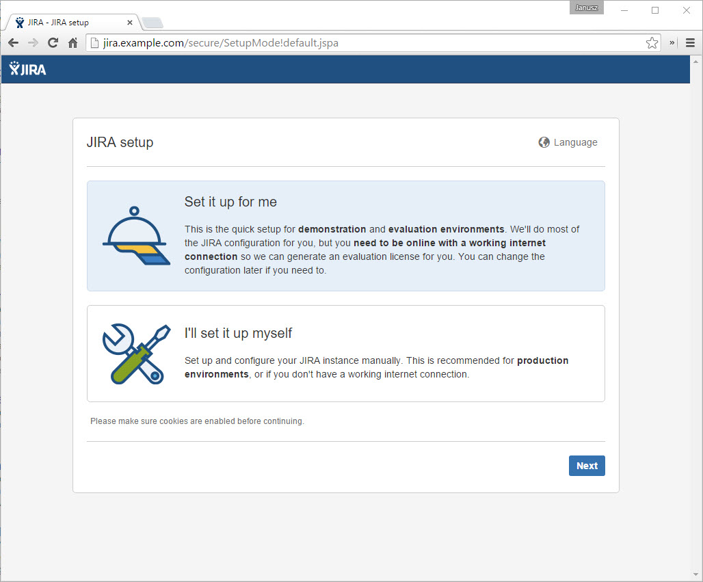
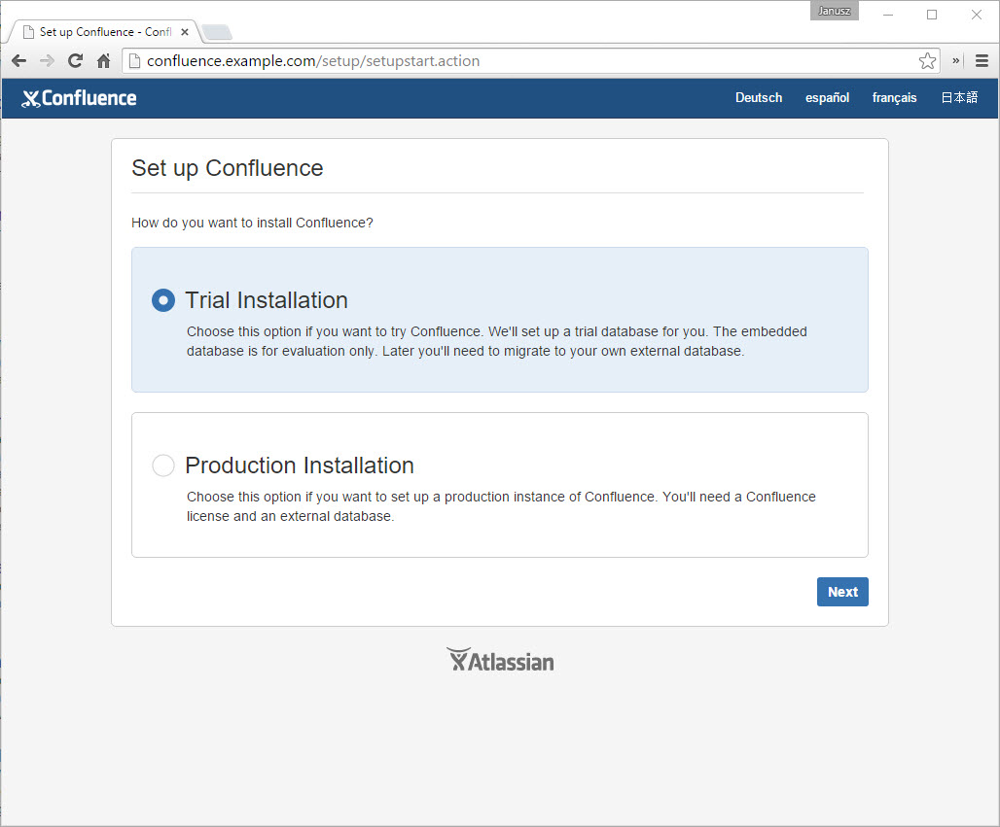
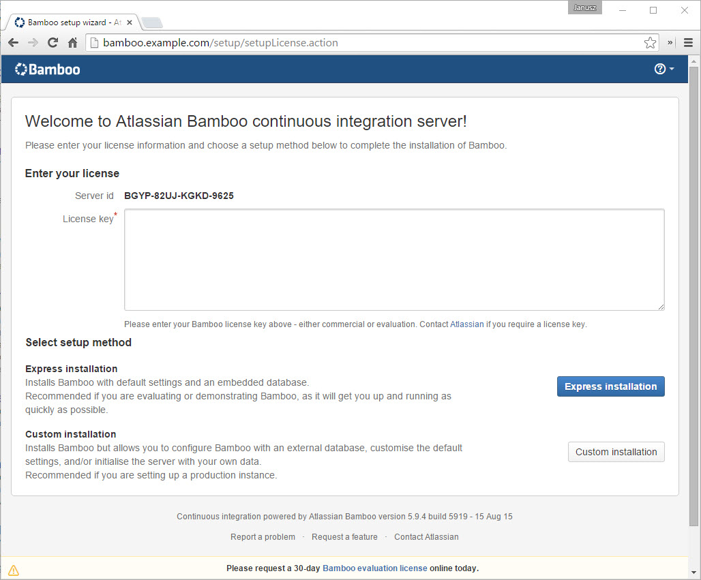

# jira-sandbox

Playground sandbox for Atlassian applications with automated server setup with [vagrant](https://www.vagrantup.com). 
The aim of this project is to get a sandbox running in 3 steps:

    ~$ git clone https://github.com/wooyek/jira-sandbox.git
    ~$ cd jira-sandbox/
    ~/jira-sandbox$ vagrant up full

…assuming that you have all prerequisite tools installed and Atlassian software downloaded (see below) 

## Prerequisites

Before you can enjoy quick virtual machine provisioning you need to install 
[VirtualBox](https://www.virtualbox.org/) and [Vagrant](https://www.vagrantup.com/) 

On widnows please open an **administrative** cmd.exe command prompt and run these commands there

    @powershell -NoProfile -ExecutionPolicy Bypass -Command "iex ((new-object net.webclient).DownloadString('https://chocolatey.org/install.ps1'))" && SET PATH=%PATH%;%ALLUSERSPROFILE%\chocolatey\bin
    choco install git
    choco install vagrant
    choco install putty
    vagrant plugin install vagrant-multi-putty
    

### Manual install 

If you like to have total control over what and how software is intalled on your machine, please install there manually:

- https://www.virtualbox.org
- https://www.vagrantup.com
- https://git-scm.com/downloads

I you want to have an ssh access to the virtual machine you should install [PuTTY](http://www.chiark.greenend.org.uk/~sgtatham/putty/download.html) 
on windows. 
On linux you should have an `ssh` tool installed by default.  

- http://www.chiark.greenend.org.uk/~sgtatham/putty/download.html 

## Download Atlassian software

Please download Atlassian software installation files
and put them in [downloads](downloads) folder:

You can download them with [download-x64.sh](download-x64.sh) script. Or manually

1. [atlassian-jira-software-7.0.0-jira-7.0.0-x64.bin](https://www.atlassian.com/software/jira/downloads/binary/atlassian-jira-software-7.0.0-jira-7.0.0-x64.bin)
2. [atlassian-servicedesk-3.0.0-jira-7.0.0-x64.bin](https://www.atlassian.com/software/jira/downloads/binary/atlassian-servicedesk-3.0.0-jira-7.0.0-x64.bin)
1. [atlassian-confluence-5.8.14-x64.bin](https://www.atlassian.com/software/confluence/downloads/binary/atlassian-confluence-5.8.14-x64.bin)
2. [atlassian-bitbucket-4.0.2-x64.bin](https://www.atlassian.com/software/stash/downloads/binary/atlassian-bitbucket-4.0.2-x64.bin)
4. [atlassian-bamboo-5.9.4.tar.gz](https://www.atlassian.com/software/bamboo/downloads/binary/atlassian-bamboo-5.9.4.tar.gz)

## Sub domain mapping on host system

To use this sandbox you'll need to map few domains to VM private network IPs. You'll need admin privileges to do this.

On Windows host edit `%SystemRoot%\System32\drivers\etc\hosts` file:

On Linux host edit `/etc/hosts` file:

…and append it with contents of [hosts.txt](hosts.txt) file.

## Virtual machine provisioning

To finish setting up this sandbox run:

    jira-sandbox$ vagrant up full
    
or
    
    jira-sandbox$ vagrant up testing
    
See [vagrant up](https://docs.vagrantup.com/v2/getting-started/index.html) command description for more details. 

## Post setup configuration
 
After your sandbox virtual machine is up and running, you should be able to access it through following URLs.
Each time select testing configuration with built in database for quick configuration.
 
1. http://jira.example.com/  
    
    
2. http://confluence.example.com/
    During setting up user managment with JIRA user `jira-software-users` instead of `jira-users`.
    
    
    
3. http://bitbucket.example.com/  
    

4. http://bamboo.example.com/  
    

## Run on different port than 80

I you have port 80 already taken, you can change port mapping in [Vagrantfile](Vagrantfile) 
and listening port for Nginx in [atlassian.conf](atlassian.conf), then:

    ~$ vagrant reload
    ~$ vagrant ssh full
    vagrant@jira-sandbox:~$ sudo cp /vagrant/atlassian.conf ./
    vagrant@jira-sandbox:~$ sudo nginx -s reload
    
## One domain with context paths

There is an experimental support for one domain and setup of all services in context paths like http://localhost/jira.

To run services on one domain you'll need to modify Tomcat configuration files on installes services. See the [attlasian-one-domain.sh](attlasian-one-domain.sh) for examples.

Nginx configuration for this setup is in [atlassian-one-domain.conf](atlassian-one-domain.conf).

Please bare in mind that you'll problaby run into issues with Bitbucket 
as [cookies can be overwritten by different services](https://confluence.atlassian.com/display/BitbucketServerKB/XSRF+Security+Token+Missing).
 
## Environment update

When you want re-provision the environment use these commands:

    ~/jira-sandbox$ git pull origin master
    ~/jira-sandbox$ vagrant destroy basic
    ~/jira-sandbox$ vagrant up basic
